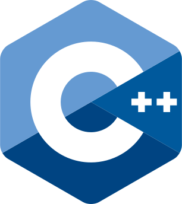

## Hi There, I'm aliazhar 👋

## I'm a Newbie Developer, Trader, and Student!!

- 🌱 I’m currently learning everything 🤣
- 🚘 Trying to become a Full-Stack developer 🤝
- 🐧 Arch Linux Fanboy 😁
- 🤸 Code is like humor. When you have to explain it, it’s bad. 🙊
- ⚡ I don't like to wait and I don't like to keep others waiting 💣

### Connect with me:

 

### Languages and Tools:

 
 

---

  
:zap: Github Profile

  
  

  
:zap: Most Used Languages

  
  

  
:zap: GitHub Stats

  

